# Project Overview

`graphql-lean` is a Lean formalization workspace for a scoped plain GraphQL
fragment.

Canonical GraphQL specification reference:
[GraphQL September 2025 Edition](https://spec.graphql.org/September2025/).

## Repository Layout

The Lean code is split by role:

- `GraphQL/`: public definitions for the scoped GraphQL model and public
  project-theory definitions.
- `Proofs/GraphQL/`: theorem modules and proof-facing helper definitions,
  mirroring the public definition areas.
- `Tests/GraphQL/`: ordinary tests for public definitions and proof-facing APIs,
  grouped by the same topic paths.
- `Tests/Conformance/`: generated or fixture-driven conformance tests.
- `Lint/`: project-local tooling, including import-closure checks.

The root import files are intentionally small. `GraphQL.lean` imports public
definition surfaces, `Proofs.lean` imports theorem surfaces, and `Tests.lean`
imports only `Tests.GraphQL` and `Tests.Conformance`.

## Dependency Diagram

```mermaid
flowchart TD
  Schema["GraphQL.Schema"]
  SchemaWF["GraphQL.SchemaWellFormedness"]
  Operation["GraphQL.Operation"]
  Validation["GraphQL.Validation"]
  ExecutionReadiness["GraphQL.Theories.ExecutionReadiness"]
  NormalForm["GraphQL.Theories.NormalForm"]
  AnnotatedExecution["GraphQL.Theories.AnnotatedExecution"]
  SelectionConditions["GraphQL.Theories.SelectionConditions"]
  ResponseMeasure["GraphQL.Theories.ResponseMeasure"]
  ConditionTree["GraphQL.Theories.ConditionTree"]
  ConditionTreeTermination["GraphQL.Theories.ConditionTree.Termination"]
  ConditionTreeExecution["GraphQL.Theories.ConditionTree.Execution"]
  ConditionTreeReduce["GraphQL.Theories.ConditionTree.Reduce"]
  QueryInclusion["GraphQL.Theories.QueryInclusion"]
  TreeSummary["GraphQL.Theories.TreeSummary"]
  TreeSummaryCore["GraphQL.Theories.TreeSummary.Core"]
  TreeSummaryResponseFold["GraphQL.Theories.TreeSummary.ResponseFold"]
  TreeSummarySyntactic["GraphQL.Theories.TreeSummary.Syntactic"]
  TreeSummaryExact["GraphQL.Theories.TreeSummary.ExactCases"]
  TreeSummaryOptimality["GraphQL.Theories.TreeSummary.ExactCasesOptimality"]
  StaticCost["GraphQL.Theories.TreeSummary.StaticCost"]
  MaxResponseSize["GraphQL.Theories.TreeSummary.MaxResponseSize"]
  NormalFormGround["Proofs.GraphQL.Theories.NormalForm.GroundTypeNormalization"]
  CompleteNormalization["Proofs.GraphQL.Theories.NormalForm.CompleteNormalization"]
  ProofAnnotatedExecution["Proofs.GraphQL.Theories.AnnotatedExecution"]
  ProofConditionTree["Proofs.GraphQL.Theories.ConditionTree/*"]
  ProofQueryInclusion["Proofs.GraphQL.Theories.QueryInclusion/*"]
  Execution["GraphQL.Execution"]
  NamedFragment["GraphQL.NamedFragment/*"]
  Canceling["GraphQL.Algorithms.ExecutionCancelingSiblings"]
  ProofCanceling["Proofs.GraphQL.Algorithms.ExecutionCancelingSiblings"]
  Ungrouped["GraphQL.Algorithms.ExecutionUngrouped"]
  UngroupedUncached["GraphQL.Algorithms.ExecutionUngroupedUncached"]
  ProofUngrouped["Proofs.GraphQL.Algorithms.ExecutionUngrouped"]
  Breadth["GraphQL.Algorithms.ExecutionBreadth"]
  ProofBreadth["Proofs.GraphQL.Algorithms.ExecutionBreadth"]
  GraphQLRoot["GraphQL"]
  ProofRoot["Proofs"]
  TestsGraphQL["Tests.GraphQL"]
  TestsConformance["Tests.Conformance"]
  TestsRoot["Tests"]
  ImportClosure["Lint.ImportClosure"]
  LintRoot["Lint"]

  Schema --> SchemaWF
  Schema --> Operation
  Operation --> Validation
  Operation --> NormalForm
  Operation --> Execution
  Execution --> ExecutionReadiness
  Execution --> AnnotatedExecution
  Execution --> SelectionConditions
  Operation --> ResponseMeasure
  ExecutionReadiness --> NormalForm
  ExecutionReadiness --> QueryInclusion
  SelectionConditions --> ConditionTree
  SelectionConditions --> QueryInclusion
  ResponseMeasure --> QueryInclusion
  AnnotatedExecution --> QueryInclusion
  Operation --> NamedFragment
  SchemaWF --> NormalForm
  Validation --> NormalForm
  ConditionTree --> ConditionTreeTermination
  ConditionTreeTermination --> ConditionTreeExecution
  ConditionTreeTermination --> ConditionTreeReduce
  ConditionTreeTermination --> TreeSummaryCore
  TreeSummaryCore --> TreeSummaryResponseFold
  AnnotatedExecution --> TreeSummaryResponseFold
  TreeSummaryResponseFold --> TreeSummarySyntactic
  TreeSummaryResponseFold --> TreeSummaryExact
  ConditionTreeExecution --> TreeSummarySyntactic
  ConditionTreeExecution --> TreeSummaryExact
  TreeSummaryExact --> TreeSummaryOptimality
  TreeSummaryCore --> TreeSummary
  AnnotatedExecution --> TreeSummary
  TreeSummarySyntactic --> TreeSummary
  TreeSummaryExact --> TreeSummary
  TreeSummaryOptimality --> TreeSummary
  TreeSummarySyntactic --> MaxResponseSize
  TreeSummaryOptimality --> MaxResponseSize
  TreeSummaryResponseFold --> StaticCost
  TreeSummarySyntactic --> StaticCost
  TreeSummaryOptimality --> StaticCost
  Execution --> ConditionTreeExecution
  Execution --> ConditionTreeReduce
  NormalForm --> NormalFormGround
  NormalForm --> CompleteNormalization
  Execution --> Canceling
  Execution --> Ungrouped
  Execution --> UngroupedUncached
  Execution --> Breadth
  ExecutionReadiness --> Ungrouped
  ExecutionReadiness --> UngroupedUncached
  ExecutionReadiness --> Breadth
  Canceling --> Ungrouped
  Canceling --> UngroupedUncached
  NamedFragment --> GraphQLRoot
  NormalFormGround --> ProofRoot
  CompleteNormalization --> ProofRoot
  AnnotatedExecution --> ProofAnnotatedExecution
  ConditionTree --> ProofConditionTree
  QueryInclusion --> ProofQueryInclusion
  ProofConditionTree --> ProofRoot
  ProofQueryInclusion --> ProofRoot
  ProofAnnotatedExecution --> ProofRoot
  Canceling --> ProofCanceling
  ProofCanceling --> ProofRoot
  Ungrouped --> ProofUngrouped
  UngroupedUncached --> ProofUngrouped
  ProofUngrouped --> ProofRoot
  Breadth --> ProofBreadth
  ProofBreadth --> ProofRoot

  SchemaWF --> GraphQLRoot
  Operation --> GraphQLRoot
  Validation --> GraphQLRoot
  ExecutionReadiness --> GraphQLRoot
  Canceling --> GraphQLRoot
  Ungrouped --> GraphQLRoot
  UngroupedUncached --> GraphQLRoot
  Breadth --> GraphQLRoot
  NormalForm --> GraphQLRoot
  AnnotatedExecution --> GraphQLRoot
  SelectionConditions --> GraphQLRoot
  ResponseMeasure --> GraphQLRoot
  ConditionTree --> GraphQLRoot
  QueryInclusion --> GraphQLRoot
  ConditionTreeExecution --> GraphQLRoot
  ConditionTreeReduce --> GraphQLRoot
  TreeSummary --> GraphQLRoot
  StaticCost --> GraphQLRoot
  MaxResponseSize --> GraphQLRoot
  Execution --> GraphQLRoot
  GraphQLRoot --> TestsGraphQL
  ProofRoot --> TestsGraphQL
  GraphQLRoot --> TestsConformance
  TestsGraphQL --> TestsRoot
  TestsConformance --> TestsRoot
  ImportClosure --> LintRoot
```

## Modules

The plain GraphQL layer is organized under the top-level `GraphQL` library root.
It should remain definition-only.

- `GraphQL.Schema`: shared names, type references, input values, constant input
  values, built-in scalars, custom scalars, enums, objects, interfaces, unions,
  input objects, field definitions, argument definitions, lookup helpers,
  possible-object inclusion, constant default-value validation, and output
  subtype checks.
- `GraphQL.SchemaWellFormedness`: schema-level invariants separated from raw
  schema syntax, including unique names, non-empty definition/member lists,
  root query object type, valid type references/defaults, and object/interface
  implementation compatibility.
- `GraphQL.Operation`: operation syntax, field arguments, variable definitions,
  built-in directive applications, selections, inline fragments, operation size,
  and shared selection helpers. Named fragment definitions and fragment spreads
  are separated into `GraphQL.NamedFragment`.
- `GraphQL.Validation`: validation as a proposition over a schema and operation,
  including variable definitions/defaults, all declared variables used in the
  operation scope, variable-use compatibility, argument checks, recursive
  input/output type checks, required non-empty selection sets, modeled
  `@skip`/`@include`, same-response-name field merge checks, and inline-fragment
  applicability.
- `GraphQL.Theories.ExecutionReadiness`: shared Boolean-support extraction and
  environment-completeness definitions, together with concrete-environment
  field-argument coercion predicates used by executors and analyses such as
  normalization and query inclusion.
- `GraphQL.Theories.NormalForm`: ground-typed normal form and non-redundancy
  predicates over operation selection sets, a normalization pass for field
  merging and abstract-type grounding, and the public resolver-parametric semantic
  preservation predicates for directive-free ground-type normalization and
  directive-aware complete normalization. Its validity-preservation predicates
  also expose operation-specific assumptions for possible-type validity and
  strict all-field type-condition feasibility after grounding. This strict
  ground assumption also lets the proof derive preservation of the
  all-variables-used validation rule. The complete-normalization
  validity predicate uses a mode-free, path-sensitive feasibility assumption:
  every selection has a compatible Boolean case, all type-condition stacks are
  feasible, and every admitted case retains a child in nonempty nested
  selection sets. This also lets the proof derive preservation of the
  all-variables-used validation rule.
- `GraphQL.Theories.AnnotatedExecution`: execution with the same response semantics as
  `GraphQL.Execution`, enriched with the original and coerced resolver call attached to
  every response field. Erasing those annotations is proved to recover ordinary
  execution exactly.
- `GraphQL.Theories.SelectionConditions`: tree-free extraction of response-field
  occurrences annotated with their cumulative type and Boolean conditions. Both query
  inclusion and condition trees consume this shared condition algebra.
- `GraphQL.Theories.ResponseMeasure`: structural response measures shared by recursive
  execution theories: the selection response-field depth metric (inline fragments do not
  consume response depth) and the plain response-value size with its termination facts.
- `GraphQL.Theories.ConditionTree/*`: condition-tree construction, runtime field
  collection, total condition-tree execution, and reduction.
  The proof modules establish extraction, pruning, reduction, and execution correctness.
- `GraphQL.Theories.QueryInclusion`: recursive response-field inclusion with resolver
  provenance, a simple reference checker, and the optimized guarded field-group checker.
  Its proof modules establish soundness and completeness for valid operations under the
  documented error-free, coercibility, and composite-return inhabitance conditions.
- `GraphQL.Theories.ConditionTree.Termination`: internal shared response-depth
  support for the tree-of-trees recursion used by execution and reduction.
- `GraphQL.Theories.ConditionTree.Execution`: selection-set execution that
  extracts each condition-tree boundary internally, traverses it in preorder,
  and globally groups parent/descendant fields by response name without
  duplicate visits. Nested object completion re-enters the same fuel-free
  selection-set API with the merged child selections. The module also owns
  extraction-coverage and operation-level execution-soundness predicates.
- `GraphQL.Theories.ConditionTree.Reduce`: selection-set reduction through the
  same tree/group/child-tree recursion shape as execution, plus the
  selection-set and operation-level semantic-preservation predicates.
- `GraphQL.Theories.TreeSummary`: the public aggregator for the condition-tree summary
  framework.
- `GraphQL.Theories.TreeSummary.Core`: the contextual, bottom-up fold interface over
  condition trees. Algebras provide a synthesized summary type plus field,
  simultaneous-composition, and alternative-join operations. Condition pruning is
  framework traversal policy, independent of the algebra.
- `GraphQL.Theories.TreeSummary.ResponseFold`: abstract and concrete algebra folds
  over the annotated responses produced by `GraphQL.Theories.AnnotatedExecution`, plus
  their shared compatibility contract.
- `GraphQL.Theories.TreeSummary.Syntactic`: direct node-local materializable
  type-condition products and factorized Boolean-case traversal together with its direct
  soundness contract.
- `GraphQL.Theories.TreeSummary.ExactCases`: composed feasible-case traversal with one
  globally shared Boolean context per selection hierarchy, node-local lazy truth-value
  decisions for explicit contexts, and node-local type-region resolution, together with
  its direct operation soundness contract.
- `GraphQL.Theories.TreeSummary.ExactCasesOptimality`: independent structural-case
  semantics and optional best-bound contracts for the exact backend.
- `GraphQL.Theories.TreeSummary.StaticCost`: IBM GraphQL Cost Directives
  static and query-response analyses, with separate type and field costs and a
  sound upper bound for the supplied variable assignment and every remaining
  unresolved directive condition.
- `GraphQL.Theories.TreeSummary.MaxResponseSize`: a list-aware
  example algebra whose `Nat` summary bounds the number of response fields.
- `GraphQL.Execution`: fuel-bounded query execution over operation selections,
  parameterized by abstract resolver functions. It materializes missing operation
  variable defaults, collects executable fields by response name, looks up each field
  definition once, materializes schema argument and nested input-object defaults, and
  passes variable-free semantic argument maps to resolvers. It also applies `@skip` /
  `@include` filtering with the effective variable map, completes values with
  list/object/non-null null bubbling, and returns a response envelope with data plus a
  `Nat` execution-error count.
  Runtime object values carry their GraphQL object type plus an optional
  resolver-owned opaque object reference; final responses do not carry object
  identity or detailed error metadata. Internal fuel exhaustion is represented
  by `Execution.outOfFuel`, a polymorphic `.error 1`.
- `GraphQL.NamedFragment/*`: fragment-aware operation syntax, validation,
  direct fragment-aware execution, inlining, and translation to the
  fragment-free operation syntax.
- `GraphQL.Algorithms.ExecutionCancelingSiblings`: collected-field execution
  that stops after a field result bubbles through its current selection set.
- `GraphQL.Algorithms.ExecutionUngrouped`: public alternative execution
  algorithm that visits selections directly, caches field results by response
  position, retains resolver sources for composite values, and merges response
  slices as it goes.
- `GraphQL.Algorithms.ExecutionUngroupedUncached`: specialization that keeps
  completed response values but resolves composite fields again on later
  compatible visits instead of retaining resolver sources.
  `GraphQL.Algorithms.ExecutionCancelingSiblings`. The cached refinement tracks
  reusable composite sources recursively and proves exact erasure to the uncached
  specialization for valid operations.
  Response-name grouping means the algorithms' exact error counts can differ.
- `GraphQL.Algorithms.ExecutionBreadth`: public breadth-first execution model
  with vectorized resolver calls and explicit scheduling, trace, slot, and
  reverse-completion state.
- `Tests.GraphQL`: ordinary test aggregator. Its modules live under
  `Tests/GraphQL/` and mirror the corresponding GraphQL or proof topic,
  including `Algorithms/ExecutionCancelingSiblings`,
  `Algorithms/ExecutionUngrouped`, `Algorithms/ExecutionBreadth`,
  `Theories/NormalForm`, `Theories/AnnotatedExecution`,
  `Theories/ConditionTree`, `Theories/TreeSummary`, and `Theories/QueryInclusion`.
- `Tests.Conformance`: generated and fixture-driven conformance test
  aggregator. Its modules live under `Tests/Conformance/`.
- `Lint`: local project tooling. `Lint.ImportClosure` checks that tracked Lean
  files are reachable from the configured public roots.

## Flow

The current flow is:

1. `GraphQL.Schema` and `GraphQL.Operation` define raw syntax.
2. `GraphQL.SchemaWellFormedness` and `GraphQL.Validation` state
   well-formedness and operation validity.
3. `GraphQL.Execution` gives fuel-bounded execution over operation selections
   by collecting fields by response name, resolving each response name once,
   completing values, and accumulating modeled execution-error counts.
4. `GraphQL.Theories.NormalForm` provides project-specific normalization
   definitions and public resolver-parametric correctness predicates.
5. `GraphQL.Theories.AnnotatedExecution` preserves execution data while recording
   resolver provenance for response analyses.
6. `GraphQL.Theories.SelectionConditions` extracts the shared flat condition algebra.
7. `GraphQL.Theories.ConditionTree` extracts unique minimal condition trees;
    its `Execution` and `Reduce` modules interpret and reduce them through the
    same tree-of-trees recursion shape.
8. `GraphQL.Theories.TreeSummary` folds those trees with algebra-defined summary
   combinators. Its generic soundness theorems relate each backend's summary to a
   concrete algebra folded over the annotated execution response. The exact backend
   additionally supports structural least-bound proofs. MaxResponseSize derives a
   bound on ordinary query execution, while StaticCost uses the annotated response to
   retain the concrete resolver-call arguments needed for actual cost.
9. `GraphQL.Theories.QueryInclusion` decides recursive, provenance-preserving inclusion
   over the response fields of valid operations.
10. `GraphQL.Algorithms.ExecutionCancelingSiblings` provides a verified collected-field
    executor that cancels remaining sibling response positions after a bubble.
11. `GraphQL.Algorithms.ExecutionUngrouped` provides a source-caching alternative
    execution algorithm over the same operation syntax.
12. `GraphQL.Algorithms.ExecutionBreadth` provides a breadth-first alternative with
    vectorized resolver calls.
13. `GraphQL.NamedFragment/*` provides fragment-aware public syntax, validation,
    execution, inlining, and translation definitions.

Normal forms consume `GraphQL.Operation` directly. The directive-free
`normalizeOperation` proof path assumes source operations have no modeled
directives. These normal forms are project proof artifacts, not GraphQL spec
features.

Complete normalization is the directive-aware path: it enumerates modeled
Boolean directive variables once at the operation root, creates one
unconditional inline-fragment case branch per complete case, and statically
collects directive-free fields for each ground type under the selected case.
Nested field child normalization receives that case as proof context and does
not introduce another directive-only BoolCase DNF.

Ungrouped execution is documented separately because it is an implementation
strategy, not part of the spec execution definition. Both the source-caching
algorithm and its uncached specialization have checked theorem witnesses summarized
in `docs/algorithms.md`.

Raw syntax remains permissive. Validation supplies the invariants that later
semantic proofs should rely on.

The normal-form correctness proofs are summarized in `docs/theories/normal-form.md`.
The ground and complete uniqueness arguments are detailed in
`docs/theories/normal-form-uniqueness.md`.
Query-inclusion semantics, checker design, and correctness premises are detailed in
`docs/theories/query-inclusion.md`.
The standalone condition-tree representation is documented in
`docs/theories/condition-tree.md`.
The tree-summary framework and max-response-size example are documented in
`docs/theories/tree-summary.md`.
Project algorithms are summarized in `docs/algorithms.md`.

Lean module organization rules are documented in
`docs/lean-organization.md`.
