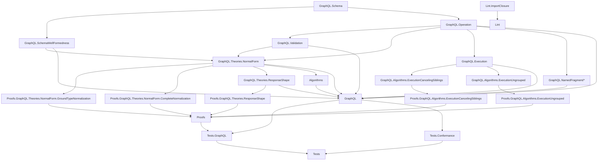

# Project Overview

`graphql-lean` is a Lean formalization workspace for a scoped plain GraphQL
fragment.

Canonical GraphQL specification reference:
[GraphQL September 2025 Edition](https://spec.graphql.org/September2025/).

## Repository Layout

The Lean code is split by role:

- `GraphQL/`: public definitions for the scoped GraphQL model and public
  project-theory definitions.
- `Proofs/GraphQL/`: theorem modules and proof-facing helper definitions,
  mirroring the public definition areas.
- `Tests/GraphQL/`: ordinary tests for public definitions and proof-facing APIs,
  grouped by the same topic paths.
- `Tests/Conformance/`: generated or fixture-driven conformance tests.
- `Lint/`: project-local tooling, including import-closure checks.

The root import files are intentionally small. `GraphQL.lean` imports public
definition surfaces, `Proofs.lean` imports theorem surfaces, and `Tests.lean`
imports only `Tests.GraphQL` and `Tests.Conformance`.

## Dependency Diagram

## Modules

The plain GraphQL layer is organized under the top-level `GraphQL` library root.
It should remain definition-only.

- `GraphQL.Schema`: shared names, type references, input values, constant input
  values, built-in scalars, custom scalars, enums, objects, interfaces, unions,
  input objects, field definitions, argument definitions, lookup helpers,
  possible-object inclusion, constant default-value validation, and output
  subtype checks.
- `GraphQL.SchemaWellFormedness`: schema-level invariants separated from raw
  schema syntax, including unique names, non-empty definition/member lists,
  root query object type, valid type references/defaults, and object/interface
  implementation compatibility.
- `GraphQL.Operation`: operation syntax, field arguments, variable definitions,
  built-in directive applications, selections, inline fragments, operation size,
  and shared selection helpers. Named fragment definitions and fragment spreads
  are separated into `GraphQL.NamedFragment`.
- `GraphQL.Validation`: validation as a proposition over a schema and operation,
  including variable definitions/defaults, all declared variables used in the
  operation scope, variable-use compatibility, argument checks, recursive
  input/output type checks, required non-empty selection sets, modeled
  `@skip`/`@include`, same-response-name field merge checks, and inline-fragment
  applicability.
- `GraphQL.Theories.NormalForm`: ground-typed normal form and non-redundancy
  predicates over operation selection sets, a normalization pass for field merging and
  abstract-type grounding, and the public resolver-parametric semantic
  preservation predicates for directive-free ground-type normalization and
  directive-aware complete normalization. Its validity-preservation predicates
  also expose operation-specific assumptions for possible-type validity and
  strict all-field type-condition feasibility after grounding. This strict
  ground assumption also lets the proof derive preservation of the
  all-variables-used validation rule. The complete-normalization
  validity predicate uses a mode-free, path-sensitive feasibility assumption:
  every selection has a compatible Boolean case, all type-condition stacks are
  feasible, and every admitted case retains a child in nonempty nested
  selection sets. This also lets the proof derive preservation of the
  all-variables-used validation rule.
- `GraphQL.Theories.ResponseShape`: public response-shape syntax, computable
  clause, ground-set, and recursive shape validity predicates; shape
  computation from directive-aware complete-normal operations; semantic path
  comparison; and proof-carrying verdict data. Boolean support is copied from
  the source operation before normalization, and computation rejects malformed
  Boolean stems and non-ground branch bodies with typed errors.
- `Proofs.GraphQL.Theories.ResponseShape`: totality on valid operations,
  source-footprint correspondence, reification, executable relation deciders,
  the computed-shape/complete-normal reordering biconditional, and the
  operation comparator. Its validity layer proves that executable argument
  comparison decides the existing semantic `Argument.argumentsEquivalent`
  relation.
- `Proofs.GraphQL.Theories.NormalForm.GroundTypeNormalization`: proof-facing
  lemmas for the directive-free ground-type normalizer.
- `Proofs.GraphQL.Theories.NormalForm.CompleteNormalization`: proof-facing lemmas for complete
  normalization, which lifts modeled `@skip`/`@include` behavior into Boolean
  case branches and keeps bottom-branch fields directive-free. Its proof
  modules separate variable/directive facts, BoolCase wrappers, static
  collection, normal-shape facts, operation variables/wrappers, field and
  inline static-collection execution cases, BoolCase runtime selection,
  child completion, scoped resolver bridges, validity preservation for
  Boolean-filtered ground branches, final root semantics, and uniqueness up to
  branch, stem, and sibling reordering.
- `GraphQL.Execution`: fuel-bounded query execution over operation selections,
  parameterized by abstract resolver functions. It
  materializes missing operation variable defaults, collects executable fields
  by response name, resolves each response name once, passes field arguments to
  resolvers, applies `@skip` / `@include` filtering with the effective variable
  map, completes values with list/object/non-null null bubbling, and returns a
  response envelope with data plus a `Nat` execution-error count.
  Runtime object values carry their GraphQL object type plus an optional
  resolver-owned opaque object reference; final responses do not carry object
  identity or detailed error metadata. Internal fuel exhaustion is represented
  by `Execution.outOfFuel`, a polymorphic `.error 1`.
- `GraphQL.NamedFragment/*`: fragment-aware operation syntax, validation,
  direct fragment-aware execution, inlining, and translation to the
  fragment-free operation syntax.
- `Proofs.GraphQL.NamedFragment`: proof witnesses connecting fragment-aware
  validity and execution with the inlined fragment-free representation.
- `GraphQL.Algorithms.ExecutionCancelingSiblings`: collected-field execution
  that stops after a field result bubbles through its current selection set.
- `Proofs.GraphQL.Algorithms.ExecutionCancelingSiblings`: the unconditional
  resolver-parametric proof that sibling cancellation preserves response data
  and execution-error presence, though not exact error counts.
- `GraphQL.Algorithms.ExecutionUngrouped`: public alternative execution
  algorithm that visits selections directly and merges response slices as it
  goes.
- `Proofs.GraphQL.Algorithms.ExecutionUngrouped`: theorem modules for the
  ungrouped algorithm. Its public theorem preserves response data and error
  presence against `GraphQL.Execution`, but not exact execution-error counts.
  It also proves the same equivalence against
  `GraphQL.Algorithms.ExecutionCancelingSiblings` by transitivity through the
  spec executor. Response-name grouping means the two algorithms' exact error
  counts can differ.
- `Tests.GraphQL`: ordinary test aggregator. Its modules live under
  `Tests/GraphQL/` and mirror the corresponding GraphQL or proof topic,
  including `Algorithms/ExecutionCancelingSiblings`,
  `Algorithms/ExecutionUngrouped`, `Theories/NormalForm`, and
  `Theories/ResponseShape`.
- `Tests.Conformance`: generated and fixture-driven conformance test
  aggregator. Its modules live under `Tests/Conformance/`.
- `Lint`: local project tooling. `Lint.ImportClosure` checks that tracked Lean
  files are reachable from the configured public roots.

## Flow

The current flow is:

1. `GraphQL.Schema` and `GraphQL.Operation` define raw syntax.
2. `GraphQL.SchemaWellFormedness` and `GraphQL.Validation` state
   well-formedness and operation validity.
3. `GraphQL.Execution` gives fuel-bounded execution over operation selections
   by collecting fields by response name, resolving each response name once,
   completing values, and accumulating modeled execution-error counts.
4. `GraphQL.Theories.NormalForm` provides project-specific normalization
   definitions and public resolver-parametric correctness predicates.
5. `GraphQL.Theories.ResponseShape` decodes complete-normal operations into
   concrete-object-indexed response positions guarded by Boolean clauses.
6. `GraphQL.Algorithms.ExecutionCancelingSiblings` provides a verified
   collected-field executor that cancels remaining sibling response positions
   after a bubble.
7. `GraphQL.Algorithms.ExecutionUngrouped` provides a verified alternative
   execution algorithm over the same operation syntax.
8. `GraphQL.NamedFragment/*` provides fragment-aware public syntax,
   validation, execution, inlining, and translation definitions.
9. `Proofs.GraphQL.NamedFragment` provides equivalence and validity bridges
   through inlining and translation to the fragment-free syntax.
10. `Proofs.GraphQL.Theories.NormalForm.GroundTypeNormalization` provides
   proof-facing ground-type lemmas.
11. `Proofs.GraphQL.Theories.NormalForm.CompleteNormalization` provides
   proof-facing lemmas for directive-aware Boolean case branch normalization.
12. `Proofs.GraphQL.Theories.ResponseShape` connects computed shapes to source
    footprints and complete-normal reordering, then packages the executable
    shape and operation comparators with their semantic contracts.

Normal forms consume `GraphQL.Operation` directly. The directive-free
`normalizeOperation` proof path assumes source operations have no modeled
directives. These normal forms are project proof artifacts, not GraphQL spec
features.

Complete normalization is the directive-aware path: it enumerates modeled
Boolean directive variables once at the operation root, creates one
unconditional inline-fragment case branch per complete case, and statically
collects directive-free fields for each ground type under the selected case.
Nested field child normalization receives that case as proof context and does
not introduce another directive-only BoolCase DNF.

Ungrouped execution is a verified algorithmic alternative to `GraphQL.Execution`.
It is documented separately because it is an implementation strategy, not part
of the spec-facing execution definition.

Raw syntax remains permissive. Validation supplies the invariants that later
semantic proofs should rely on.

The normal-form correctness proofs are summarized in `docs/normal-form.md`.
The ground and complete uniqueness arguments are detailed in
`docs/normal-form-uniqueness.md`.
Verified project algorithms are summarized in `docs/algorithms.md`.

Lean module organization rules are documented in
`docs/lean-organization.md`.
